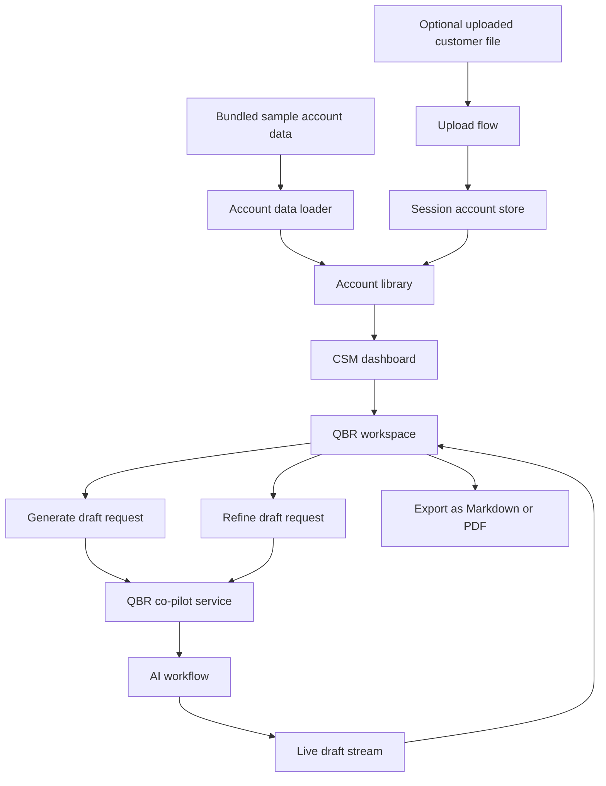
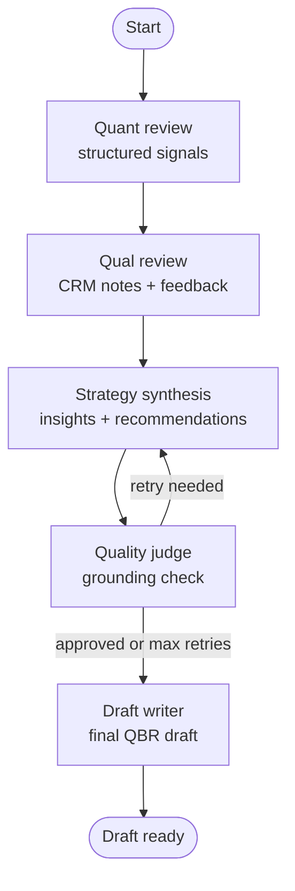
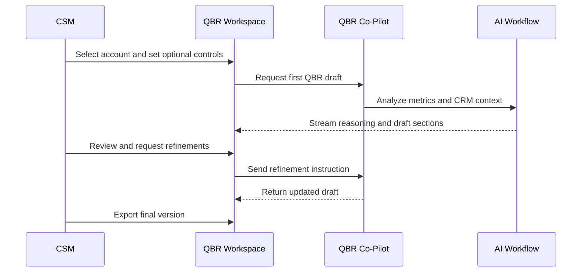

# Flow Architecture Diagram

## 1. Product Flow Overview

This diagram shows the high-level product flow: account data is loaded, the CSM selects an account, the co-pilot generates a first draft, and the workspace supports refinement and export.

## 2. AI Reasoning Workflow

This is the core AI workflow. Instead of relying on one large prompt, the co-pilot separates signal extraction, strategic synthesis, quality review, and final drafting so the result is easier to trust and easier to review.

## 3. CSM Journey Sequence

This sequence diagram shows the intended user journey: the CSM stays in control throughout the workflow, while the co-pilot accelerates drafting, explains its reasoning, and supports revision before export.
